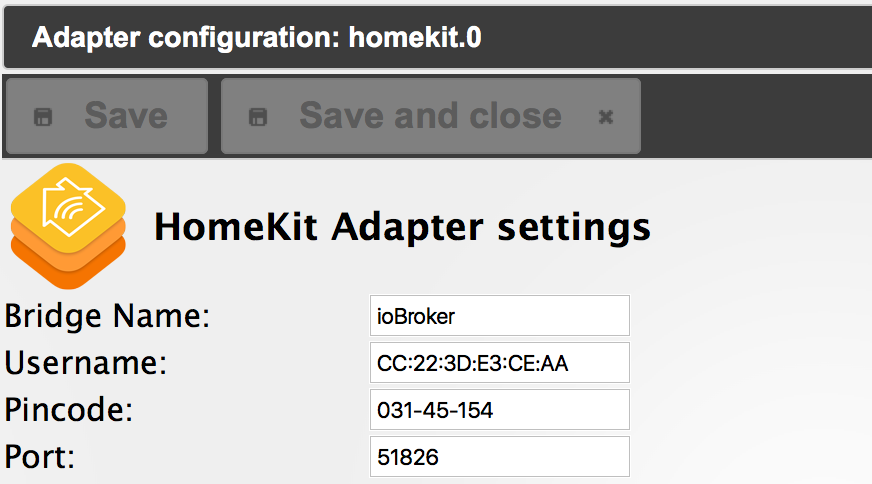

ioBroker HomeKit Adapter
==============

HomeKit Adapter for ioBroker

With this Adapter it is possible to use your iOS Device native for ioBroker Home Automation.

Within Admin Settings you can set following Attributes
- username
- port
- pincode
- bridge name

## Installation
- Enums are no longer needed, Objects were included cause of ioBroker roles.

(For Usage you must define a enum named enum.homekit.
There you must include all needed Objects.
Set a common Name for all Objects e.g. hm-rpc.0.JEQ0225305.1.TEMPERATURE = Kinderzimmer)

You can use every Homekit App on iOS. These Version is tested with Elgato Eve cause it's free.

Currently implemented are: 
 - Homematic Thermostat
 - Homematic Switch
 - zWave Temperature
 - zWave Switch
 
Supported Roles from ioBroker:
 - value.temperature
 - indicator.battery (Not tested)
 - value.battery (Not tested)
 - alarm (Not tested)
 - level.temperature
 - switch
 - value.humidity
 - level.dimmer
 
If iobroker.weatherground is used, forecast Objects are explicit removed from homekit.
 
Within Homekit you can see the actual temperature and humidity from the Thermostat.
The Switch can be used within Homekit.

## Changelog
### 0.1.1 (2016-01-31)
 - (husky-koglhof)
   fixed: Error when weatherground Adapter not found
   added: Role level.dimmer (Switch and Brightness)
   
### 0.1.0 (2016-01-29)
 - (husky-koglhof) 
   fixed: timeout of homekit protocol
   fixed: zwave states change loop
   added: States are updated automatically in iOS
   added: zWave Objects

### 0.0.10 (2016-01-23)
 - (husky-koglhof) changed Store to correct path
 
### 0.0.8 (2016-01-22)
 - (husky-koglhof) Moved persistent Store to iobroker-data/homekit.0
   removed sensor.* Types
   added WeatherUnderGround Feature (forecast Objects are disabled)
   
### 0.0.7 (2015-12-13)
 - (husky-koglhof) Fixed saving admin Settings
 
### 0.0.6 (2015-12-12)
 - (husky-koglhof) Added new Devices
   Temperature can now be a negative Value (Needed for Outdoor Temperature)
   Package Name changed to lowercase
   Removed Dependency for installation of Packages
   
### 0.0.5 (2015-12-07)
 - (husky-koglhof) Added admin Table for Devices
 
### 0.0.4 (2015-12-05)
 - (husky-koglhof) Replaced hardcoded Values for Homematic
   Added Configuration for generic Objects.
   Currently tested:
   Homematic
   HM-CC-TC, HM-CC-RT-DN (CurrentTemperature, Setpoint, Humidity)
   HM-LC-Sw1-FM, HM-LC-Sw2-FM, HM-LC-Sw4-DR (Switch)
   MAX
   BC-RT-TRX-CyG-3 (CurrentTemperature, Setpoint)
   ZWave
   FGWPE (Switch), FGSS101 (Temperature), Danfoss Living Connect Radiator Thermostat (Temperature) 
   
### 0.0.3 (2015-09-27)
 - (husky-koglhof) added Support for HM-CC-TC, HM-CC-RT-DN and BC-RT-TRX-CyG-3 Thermostat
   Supported now Actual Temperature, Set Temperature, Humidity
 
### 0.0.2 (2015-09-27)
 - (husky-koglhof) Refresh States if "Room" is refreshed.
 
### 0.0.1 (2015-09-26)
 - (husky-koglhof) Initial commit. Still non-functional.

## Todo
Implement set Temperature for Homematic, etc.

## License

## Lizenz

Copyright (c) 2015 husky-koglhof

[CC BY-NC-SA 4.0](http://creativecommons.org/licenses/by-nc-sa/4.0/)

Der obige Urheberrechtsvermerk ist in allen Kopien oder Teilkopien der Software beizulegen.

DIE SOFTWARE WIRD OHNE JEDE AUSDRÜCKLICHE ODER IMPLIZIERTE GARANTIE BEREITGESTELLT, EINSCHLIESSLICH DER GARANTIE ZUR BENUTZUNG FÜR DEN VORGESEHENEN ODER EINEM BESTIMMTEN ZWECK SOWIE JEGLICHER RECHTSVERLETZUNG, JEDOCH NICHT DARAUF BESCHRÄNKT. IN KEINEM FALL SIND DIE AUTOREN ODER COPYRIGHTINHABER FÜR JEGLICHEN SCHADEN ODER SONSTIGE ANSPRÜCHE HAFTBAR ZU MACHEN, OB INFOLGE DER ERFÜLLUNG EINES VERTRAGES, EINES DELIKTES ODER ANDERS IM ZUSAMMENHANG MIT DER SOFTWARE ODER SONSTIGER VERWENDUNG DER SOFTWARE ENTSTANDEN.

HomeMatic und BidCoS sind eingetragene Warenzeichen der [eQ-3 AG](http://eq-3.de)
